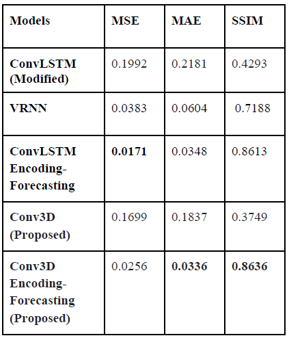
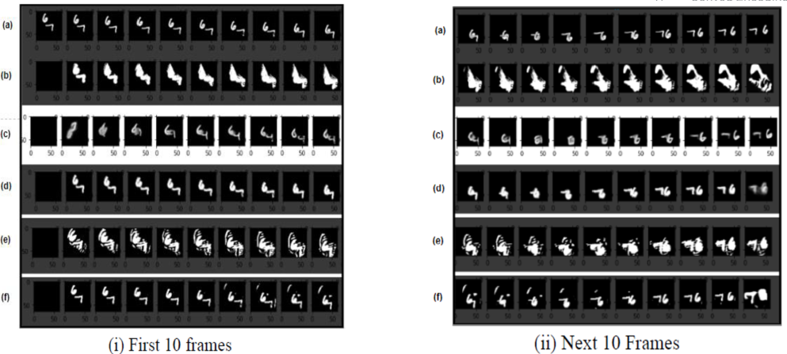
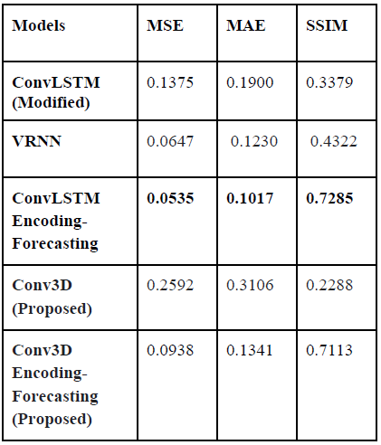
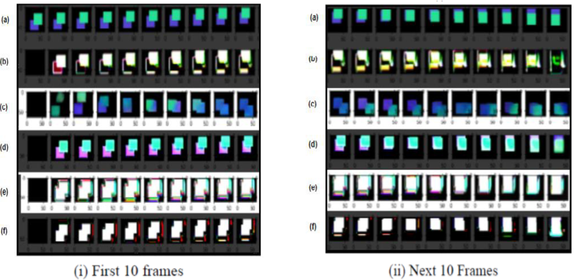

# What's Next? Next Frame Prediction with Deep Learning Approach

A project for predicting future frames based on historical frames. Deep learning approaches are experimented in this project. We proposed Convolutional 3D Network with Encoding Forecasting Structure to deal with the next 20 frames prediction. 

If you have any inquiries, please email me at genbing67@gmail.com or the collaborators, Ngiu Jin Tian Ci (j1nngiu@gmail.com) and Leow Yen Siang (yensiang99@hotmail.com).

## Result

### Moving MNISt 
Quantitative Result: 

Qualitative Result: 

### Moving Shapes
Quantitative Result: 

Qualitative Result: 

### To Reproduce Result
Please download the dataset at https://drive.google.com/drive/folders/10mqCXyCGlWw7HEa1RT-ZYx9j5mYC7yfh?usp=sharing, and placed in the required structure according to the dataset location for example:
>├─Moving_Shapes  
>>├─Conv3D.ipynb  
>>├─moving-shapes-3-te-images.npy  

>├─Moving_MNIST  
>>├─Conv3D.ipynb  
>>├─moving-mnist-3-te-images.npy  

Paper: https://drive.google.com/file/d/1JHIHGNiIP1zouaL_VW7iTmUfmBk_Eoz9/view?usp=sharing  
Presentation Slides: https://drive.google.com/file/d/1O9KPaHwLM0fZeqjluMSLa7CtY_KA9qRR/view?usp=sharing  

### Note
For VRNN, you have to run the VRNN_Train.ipynb to get the model weights before evaluation with VRNN_Test.ipynb.
